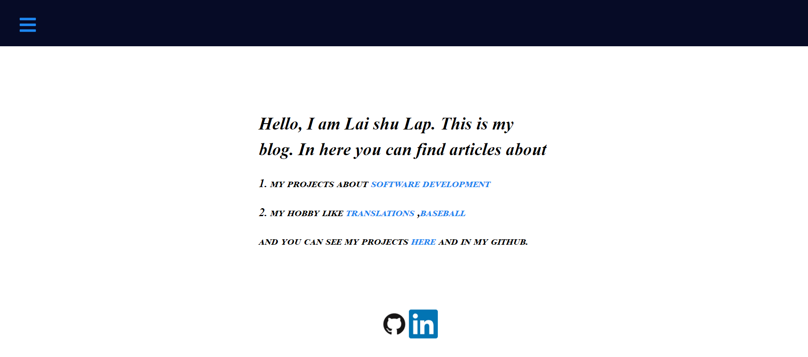

# next-blog-frontend

A simple nextjs ,strapi blog.

backend is https://github.com/shulaplai/next-blog

The website



## How to use

download /clone

```bash
npm i 
npm run dev


Your app should be up and running on [http://localhost:3000](http://localhost:3000)! 